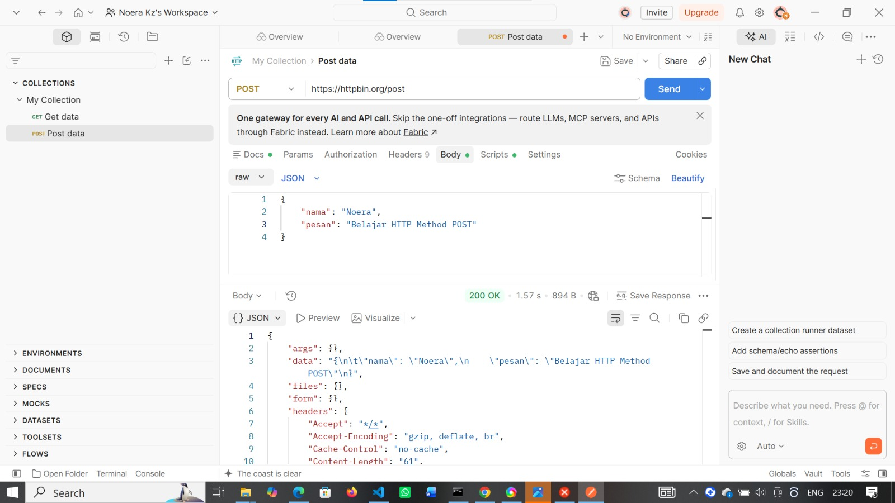
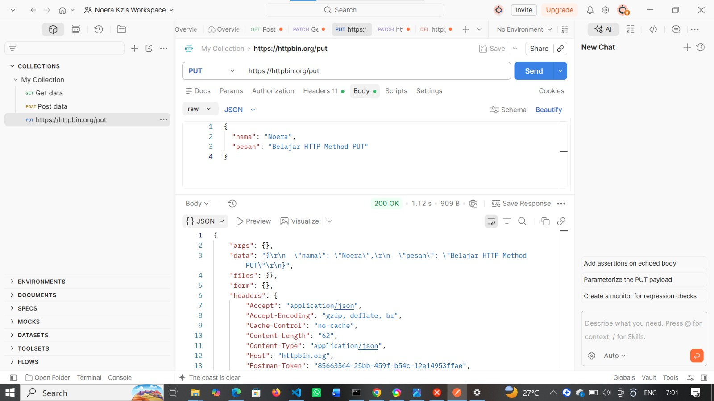

# Tugas Mandiri 1 — Mengenal HTTP Method dan Endpoint

## Hasil Pengujian HTTP Method

| No | Method | Endpoint | Data yang dikirim | Status | Hasil |
|---|---|---|---|---|---|
| 1 | GET | /get | Query parameter `nama=Noera` | 200 OK | Server mengembalikan query parameter yang dikirim |
| 2 | POST | /post | JSON/body | 200 OK | Server menerima dan mengembalikan data JSON yang dikirim |
| 3 | PUT | /put | JSON/body | 200 OK | Server menerima dan mengembalikan data JSON melalui method PUT |
| 4 | PATCH | /patch | JSON/body | 200 OK | Server menerima dan mengembalikan data JSON melalui method PATCH |
| 5 | DELETE | /delete | - | 200 OK | Server berhasil menerima request DELETE |

## Detail Pengujian

### 1. GET
- HTTP Method: GET
- URL: `https://httpbin.org/get?nama=Noera`
- Tujuan: Menguji pengambilan data menggunakan method GET.
- Data yang dikirim: Query parameter `nama=Noera`.
- Status Code: 200 OK.
- Response Body: Server mengembalikan parameter `nama` dengan nilai `Noera`.
- Informasi dari server: Server mengembalikan informasi request, termasuk args, headers, origin, dan URL.

### 2. POST
- HTTP Method: POST
- URL: `https://httpbin.org/post`
- Tujuan: Menguji pengiriman data menggunakan method POST.
- Data yang dikirim: JSON/body berisi nama dan pesan.
- Status Code: 200 OK.
- Response Body: Server mengembalikan data yang telah dikirim.
- Informasi dari server: Server mengembalikan data request beserta headers dan informasi lainnya.

### 3. PUT
- HTTP Method: PUT
- URL: `https://httpbin.org/put`
- Tujuan: Menguji pengiriman atau pembaruan data menggunakan method PUT.
- Data yang dikirim: JSON/body berisi `"nama": "Noera"` dan `"pesan": "Belajar HTTP Method PUT"`.
- Status Code: 200 OK.
- Response Body: Server mengembalikan data PUT yang telah dikirim.
- Informasi dari server: Server mengembalikan isi request beserta headers dan informasi request.

### 4. PATCH
- HTTP Method: PATCH
- URL: `https://httpbin.org/patch`
- Tujuan: Menguji pembaruan sebagian data menggunakan method PATCH.
- Data yang dikirim: JSON/body berisi `"nama": "Noera"` dan `"pesan": "Belajar HTTP Method PATCH"`.
- Status Code: 200 OK.
- Response Body: Server mengembalikan data PATCH yang telah dikirim.
- Informasi dari server: Server mengembalikan isi request beserta headers dan informasi request.

### 5. DELETE
- HTTP Method: DELETE
- URL: `https://httpbin.org/delete`
- Tujuan: Menguji request penghapusan menggunakan method DELETE.
- Data yang dikirim: Tidak ada.
- Status Code: 200 OK.
- Response Body: Server mengembalikan informasi request DELETE.
- Informasi dari server: Server mengembalikan informasi request, headers, origin, dan URL.

## Screenshot Pengujian Postman

### POST Request

### PUT Request
