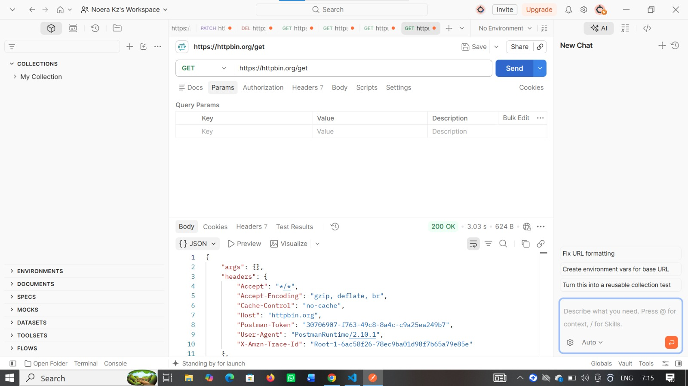
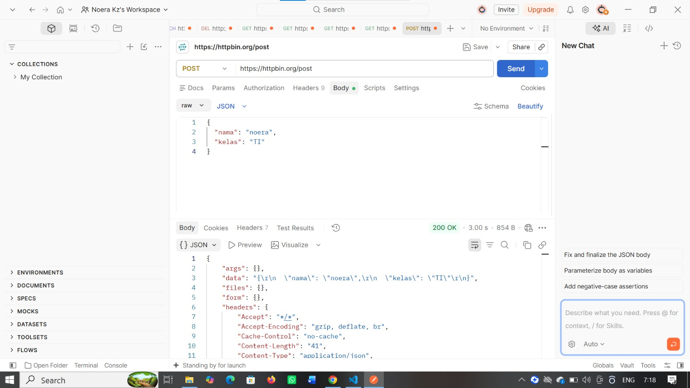
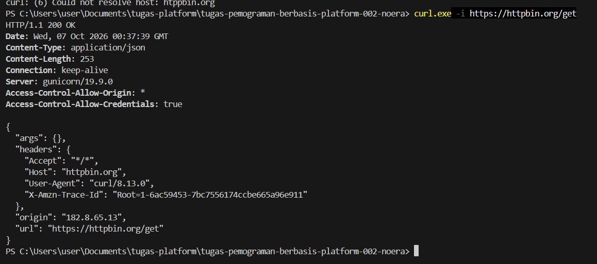
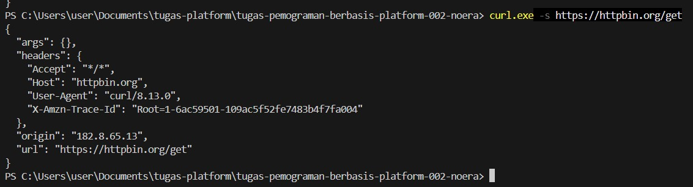

# Tugas Mandiri 4 - Pengujian API dengan Postman dan curl

## A. Menggunakan Postman

### 1. GET Request

Request yang digunakan:

GET https://httpbin.org/get

Request GET digunakan untuk mengambil data dari server. Response yang diterima menunjukkan bahwa request berhasil diproses oleh server.

### 2. POST Request

Request yang digunakan:

POST https://httpbin.org/post

JSON yang dikirim:

{
  "nama": "noera",
  "kelas": "TI"
}

Request POST digunakan untuk mengirim data ke server. Pada response POST, server mengembalikan data JSON yang sebelumnya dikirim.

### Perbandingan GET dan POST

GET digunakan untuk meminta atau mengambil data dari server tanpa mengirimkan data utama melalui request body. Sementara itu, POST digunakan untuk mengirim data kepada server melalui request body. Pada percobaan ini, response GET menampilkan informasi request GET, sedangkan response POST juga menampilkan data JSON yang dikirim.

## B. Menggunakan curl

Perintah GET:

curl -i https://httpbin.org/get

Opsi `-i` menampilkan response header beserta response body.

Perintah status 404:

curl -i https://httpbin.org/status/404

Hasil request menunjukkan status `HTTP 404 Not Found`, yang berarti resource yang diminta tidak ditemukan.

## C. Membandingkan curl -s dan curl -i

`curl -s` menjalankan curl dalam silent mode sehingga informasi progress tidak ditampilkan dan output menjadi lebih ringkas. Sementara itu, `curl -i` menampilkan response header bersama dengan

## Dokumentasi

## Dokumentasi

